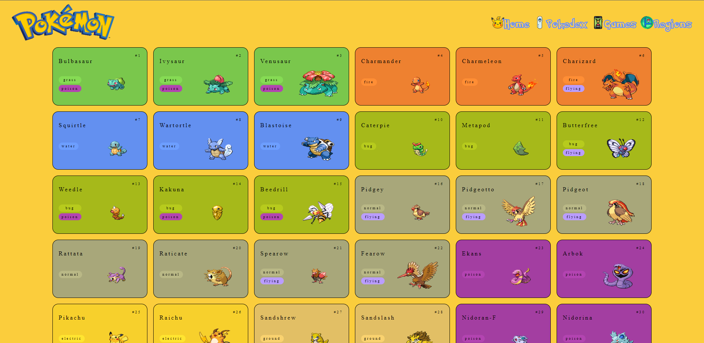

# Super-Hero
|      MOBILE         |          DESKTOP       |
|:-------------------:|:-----------------------:
|||
|                     |                        |

[Clique aqui](https://cotilen.github.io/Gotta_Catch-Em_All/ para acessar o site!

## **Sobre** 

Projeto com o objetivo de desenvolver uma plataforma web para listar e visualizar monstros, regiões, gerações e games do Universo Pokémon. Para construir este projeto, foi utilizado o javascript puro. Todos os dados foram obtidos através do uso da API REST [PokeApi](https://pokeapi.co/). 

Este desafio foi proposto colocar em prática os conhecimentos adquiridos no curso do [Senai Jandira](https://jandira.sp.senai.br/) na criação de web sites.

---

## **Relatório de Experiência** 
A API tem uma documentação completa e é fácil de usar, o unico problema que encontrei foi juntar a minha ideia do figma com as opções de JSON que a API fornece.
---

## **Tecnologias utilizadas**
- HTML
- CSS
- JavaScript
- Markdown
- Responsividade
- Rest Api
- Routes
- Web Components

---

## **Relatório LightHouse**

O Lighthouse é uma ferramenta automatizada que aprimora a qualidade dos apps da Web, simulando diversas situações que podem afetar a experiência do usuário. Relatório abaixo:

---

##  **Ferramentas**
- [Figma](https://www.figma.com/file/CVh974AZlWhwQI3TYRm446/Pokedex?type=design&node-id=0-1&t=TPFrxrxMUWVoD8Ij-0)
- GitHub
- Font Awesome
- Visual Studio Code

---
## **Critérios**
- [x]  Documentou problemas, se encontrado, para futuras consultas?
- [x]  Foi criado o layout no figma?
- [ ]  A página foi construída seguindo o planejado no Figma?
- [x]  A página funciona em dispositivos diferentes?
- [x]  Foi consumida a API escolhida?
- [x]  Foi criado web componentes?
- [x]  Foi criado um padrão de roteamente para as paginas?
- [x]  As funções foram criadas seguindo à boa prática de responsabilidade única?
- [x]  Quando possível, foi criado funções puras?
- [x]  O projeto está publicado?
- [x]  Foi criado o arquivo README.md?

---
## **Autor**
- [Cleiton Cruz](https://github.com/cotilen)  

